# 🎨 Try-On the Virtual Exhibition

<div align="center">


**An advanced AI-powered virtual try-on system for fashion and beauty products**

[Features](#-features) • [Demo](#-demo) • [Installation](#-installation) • [Architecture](#-architecture) • [API](#-api-reference) • [Contributing](#-contributing)

</div>

---

## 📋 Table of Contents

- [Overview](#-overview)
- [Features](#-features)
- [Tech Stack](#-tech-stack)
- [Installation](#-installation)
- [Configuration](#-configuration)
- [Architecture](#-architecture)
- [Workflows](#-workflows)
- [API Reference](#-api-reference)
- [Components](#-components)
- [Contributing](#-contributing)
- [Team](#-team)
- [License](#-license)

---

## 🌟 Overview

**Try-On the Virtual Exhibition** is a cutting-edge web application that enables users to virtually try on fashion and beauty products using AI-powered image generation. Built for college exhibitions, this system provides an immersive experience where students can upload photos or use their camera to see how different products look on them in real-time.


### 🎯 Key Highlights

- **AI-Powered Try-On**: Leverages Pollinations AI and Google Gemini for realistic product visualization
- **Multi-Product Layering**: Apply multiple products simultaneously (makeup, accessories, clothing)
- **Real-Time Camera**: Capture photos directly from your device camera
- **Theme Customization**: 11+ beautiful themes including Day Mode, Night Mode, Amoled, and more
- **Mobile-Friendly**: QR code generation for seamless mobile access
- **Custom Products**: Add your own products with custom images
- **Responsive Design**: Works flawlessly on desktop, tablet, and mobile devices

---

## ✨ Features

### 🖼️ Image Input
- **Upload Images**: Support for JPG and PNG formats (up to 5MB)
- **Camera Capture**: Real-time camera access with mirrored preview
- **Image Validation**: Automatic file type and size validation

### 👗 Product Selection
- **Makeup**: Lipstick, Eyeliner, Eye Shadow, Foundation (100+ options)
- **Accessories**: Sunglasses, Glasses, Hair Accessories (30+ styles)
- **Clothing**: Shirts/Tops, Dresses, Jackets (30+ items)
- **Custom Products**: Add your own products with images

### 🎨 AI Models
- **Pollinations Kontext**: Recommended for best quality
- **Pollinations NanoBanana**: Fast generation
- **Pollinations GPT Image**: Creative results
- **Google Gemini 2.5 Flash**: Advanced image understanding

### 🌈 Themes
11 pre-built themes with instant switching:
- Day Mode, Night Mode, Amoled
- Mystic Shadows, Neon Glow, Rose Gold
- Ocean Breeze, Sunset Vibes, Minimalist
- Forest Green, Cosmic Purple


---

## 🛠️ Tech Stack

### Frontend Framework


### Styling


### AI Services


### Image Hosting


### Dependencies
```json
{
  "react": "^19.2.0",
  "react-dom": "^19.2.0",
  "@google/genai": "^1.24.0",
  "@vitejs/plugin-react": "^5.0.0",
  "typescript": "~5.8.2",
  "vite": "^6.2.0",
  "dotenv": "^16.4.5"
}
```

---

## 📦 Installation

### Prerequisites
- Node.js (v18 or higher)
- npm or yarn
- API Keys (optional: Gemini API Key for Gemini model)

### Step 1: Clone the Repository
```bash
git clone https://github.com/yourusername/try-on-virtual-exhibition.git
cd try-on-virtual-exhibition
```

### Step 2: Install Dependencies
```bash
npm install
# or
yarn install
```


### Step 3: Configure Environment Variables (Optional)
If you want to use Google Gemini model, create a `.env` file in the root directory:

```env
# Google Gemini API Key (Optional - only needed for Gemini model)
VITE_GEMINI_API_KEY=your_gemini_api_key_here
```

Note: Pollinations AI models work without any API keys or tokens!

### Step 4: Start Development Server
```bash
npm run dev
# or
yarn dev
```

The application will be available at `http://localhost:3000`

### Step 5: Build for Production
```bash
npm run build
# or
yarn build
```

### Step 6: Preview Production Build
```bash
npm run preview
# or
yarn preview
```

---

## ⚙️ Configuration

### Environment Variables

| Variable | Required | Description |
|----------|----------|-------------|
| `VITE_GEMINI_API_KEY` | ❌ No | Google Gemini API key (only needed for Gemini model) |

### Vite Configuration
The project uses Vite with the following configuration:
- **Port**: 3000
- **Host**: 0.0.0.0 (accessible from network)
- **React Plugin**: Fast Refresh enabled
- **Path Aliases**: `@/` points to project root


---

## 🏗️ Architecture

### System Architecture Diagram

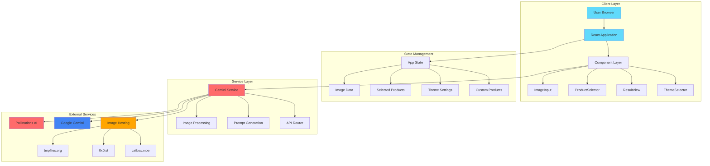

### Component Architecture

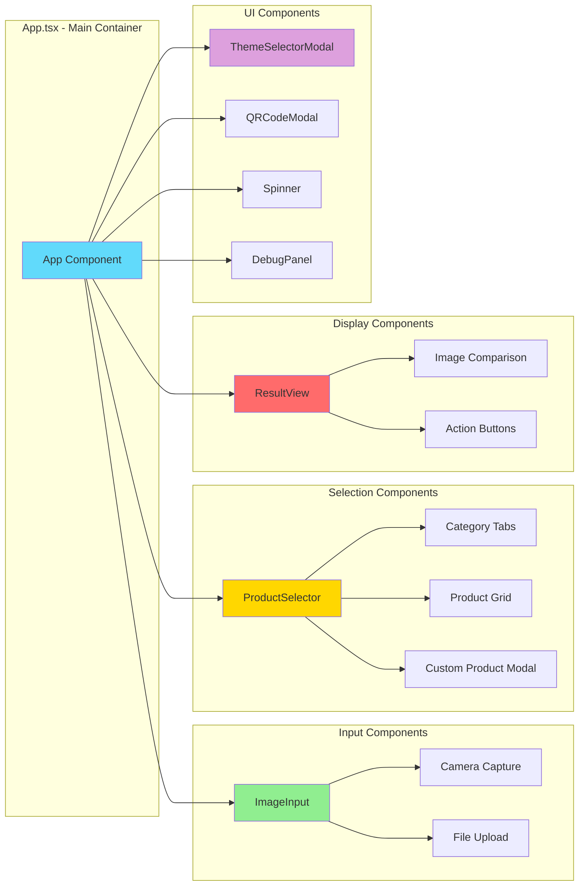


---

## 🔄 Workflows

### 1. Application Initialization Workflow

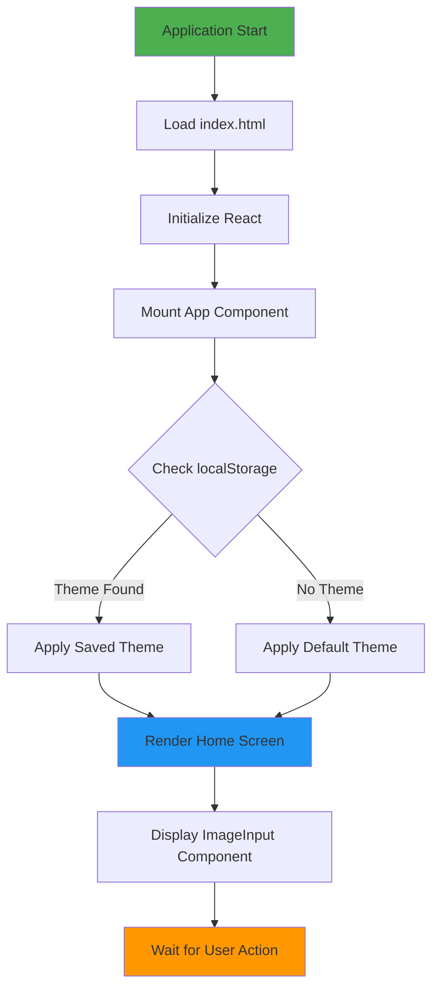

### 2. Image Upload Workflow

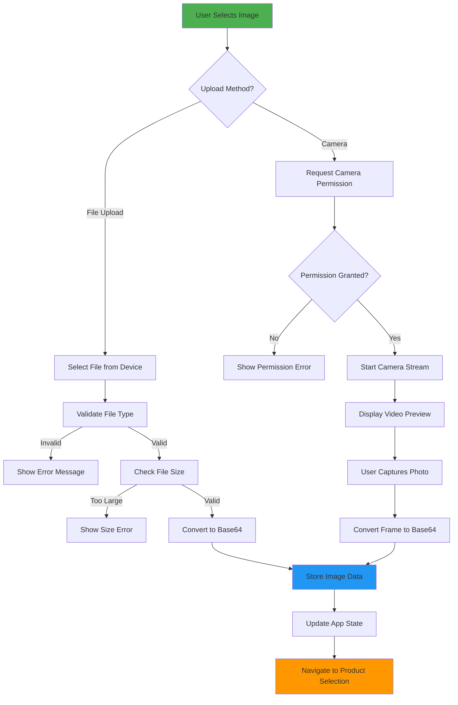

### 3. Product Selection Workflow

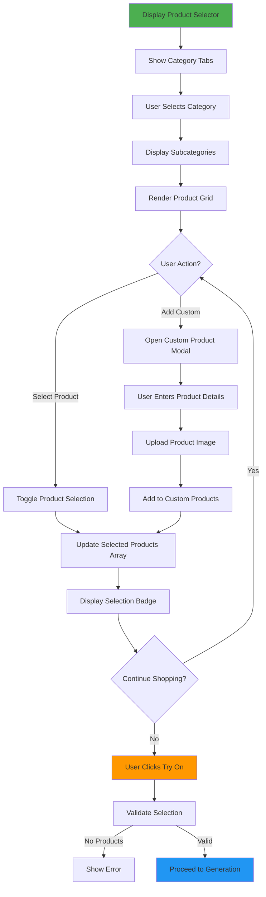


### 4. AI Image Generation Workflow (Pollinations)

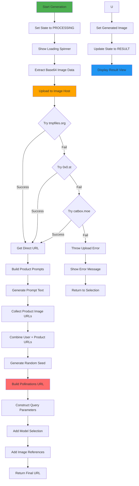

### 5. AI Image Generation Workflow (Gemini)

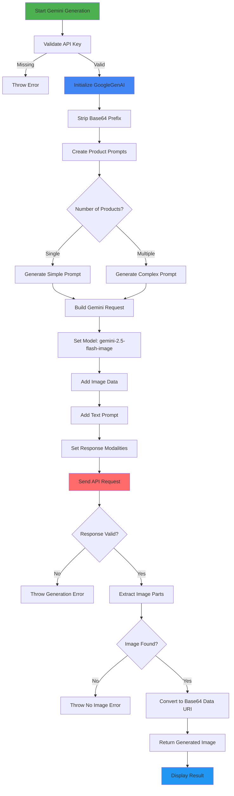


### 6. Result Display and Actions Workflow

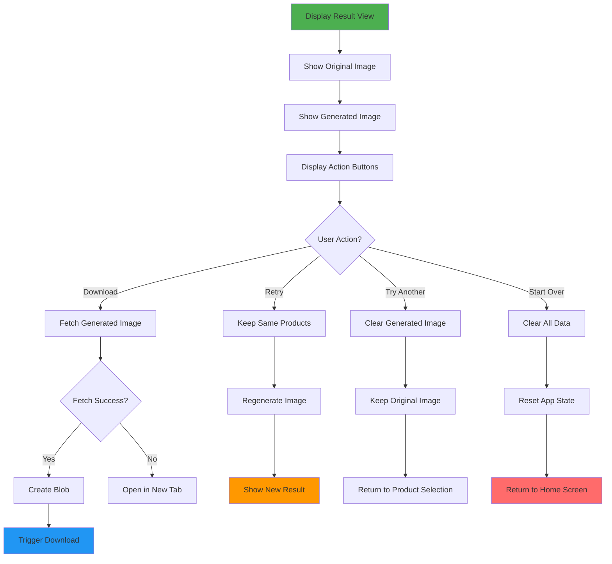

### 7. Theme Switching Workflow

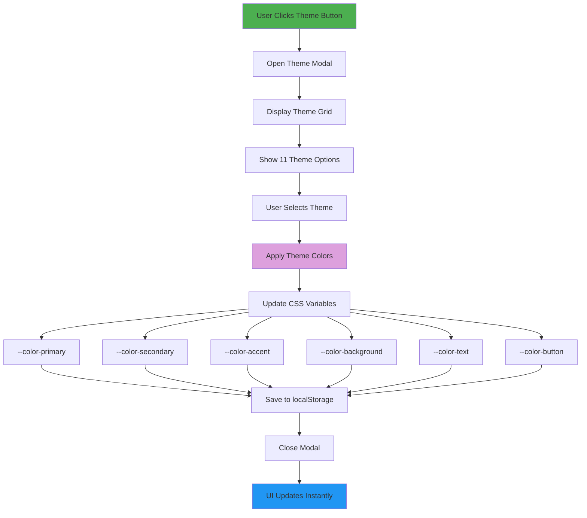

### 8. Custom Product Addition Workflow

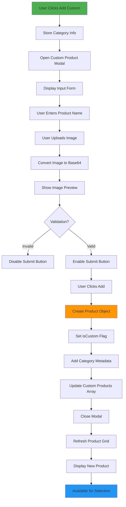


### 9. QR Code Generation Workflow

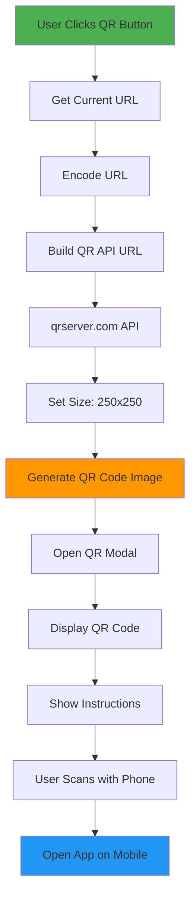

### 10. Camera Capture Workflow

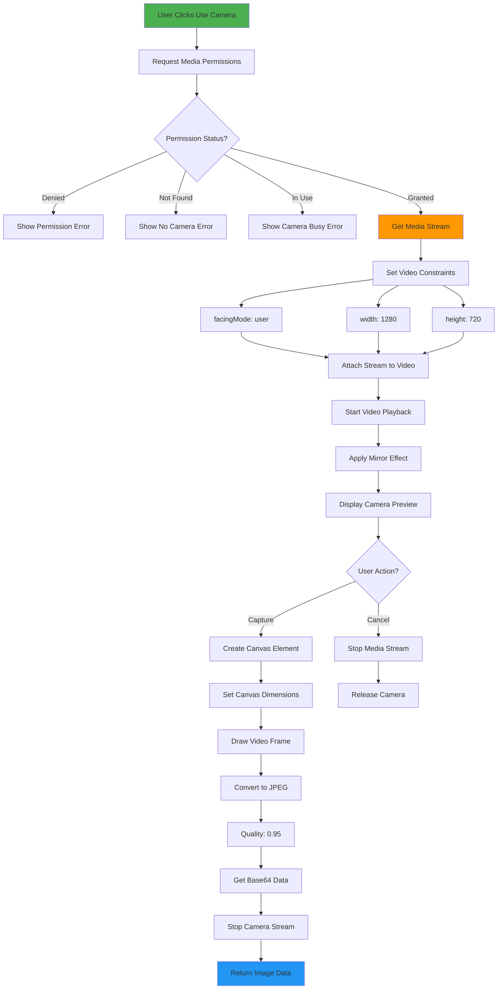

### 11. Error Handling Workflow

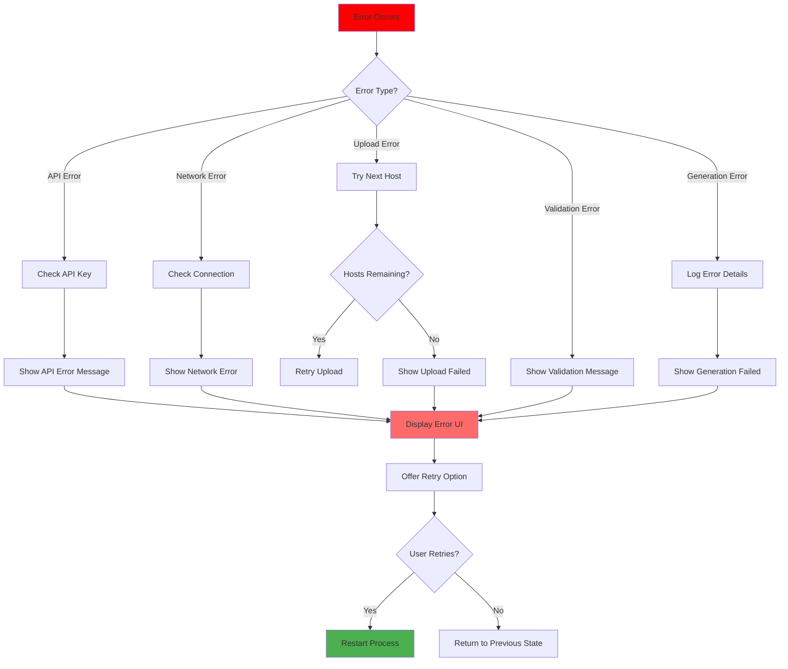


### 12. State Management Workflow

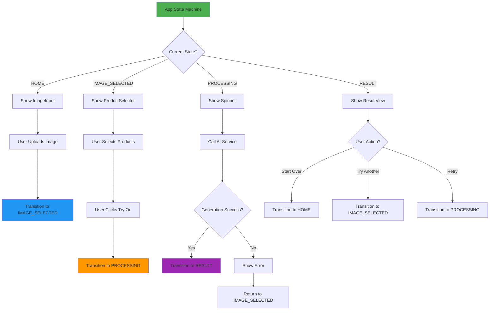

---

## 📚 API Reference

### Gemini Service API

#### `generateTryOnImage()`
Main function to generate try-on images using AI.

```typescript
async function generateTryOnImage(
  model: AiModel,
  base64Image: string,
  mimeType: string,
  productInfos: SelectedProductInfo[]
): Promise<string>
```

**Parameters:**
- `model`: AI model to use (`'pollinations-kontext'` | `'pollinations-nanobanana'` | `'pollinations-gptimage'` | `'gemini'`)
- `base64Image`: Base64-encoded image data
- `mimeType`: Image MIME type (`'image/jpeg'` | `'image/png'`)
- `productInfos`: Array of selected products with metadata

**Returns:** Promise resolving to generated image URL or base64 data

**Example:**
```typescript
const result = await generateTryOnImage(
  'pollinations-kontext',
  'data:image/jpeg;base64,...',
  'image/jpeg',
  [
    {
      product: { name: 'Crimson Red', type: 'color', value: '#DC143C' },
      category: 'Makeup',
      subCategory: 'Lipstick'
    }
  ]
);
```


#### `uploadImageToPublicHost()`
Uploads image to public hosting service with fallback support.

```typescript
async function uploadImageToPublicHost(base64Image: string): Promise<string>
```

**Upload Priority:**
1. **tmpfiles.org** - Primary host
2. **0x0.st** - First fallback
3. **catbox.moe** - Second fallback

**Returns:** Direct URL to uploaded image

#### `createGeminiPrompt()`
Generates AI prompt based on selected products.

```typescript
function createGeminiPrompt(productInfos: SelectedProductInfo[]): string
```

**Prompt Examples:**
- Single product: `"Realistically apply Crimson Red lipstick on the person..."`
- Multiple products: `"Apply the following changes: - apply Crimson Red lipstick - put on Aviator Black sunglasses..."`

---

## 🧩 Components

### Core Components

#### `App.tsx`
Main application container managing global state and routing.

**State:**
```typescript
- appState: 'HOME' | 'IMAGE_SELECTED' | 'PROCESSING' | 'RESULT'
- originalImage: { data: string; mimeType: string } | null
- generatedImage: string | null
- selectedProducts: SelectedProductInfo[]
- customProducts: Product[]
- aiModel: AiModel
```

**Key Functions:**
- `handleImageSelect()` - Process uploaded/captured images
- `handleProductToggle()` - Add/remove products from selection
- `handleTryOn()` - Trigger AI generation
- `handleReset()` - Clear all data and return to home

---

#### `ImageInput.tsx`
Handles image upload and camera capture.

**Features:**
- File upload with drag-and-drop support
- Real-time camera preview with mirror effect
- Image validation (type, size)
- Error handling for camera permissions

**Props:**
```typescript
interface ImageInputProps {
  onImageSelect: (image: { data: string; mimeType: string }) => void;
}
```

---

#### `ProductSelector.tsx`
Product browsing and selection interface.

**Features:**
- Category tabs (Makeup, Accessories, Clothing)
- Subcategory organization
- Visual product grid with previews
- Custom product addition
- Multi-select with visual feedback

**Props:**
```typescript
interface ProductSelectorProps {
  selectedProducts: SelectedProductInfo[];
  customProducts: Product[];
  onProductToggle: (info: SelectedProductInfo) => void;
  onAddCustomClick: (category: string, subCategory: string) => void;
}
```


---

#### `ResultView.tsx`
Displays original and generated images with action buttons.

**Features:**
- Side-by-side image comparison
- Download functionality with CORS fallback
- Retry with same products
- Try different products
- Start over option

**Props:**
```typescript
interface ResultViewProps {
  originalImage: string;
  generatedImage: string;
  onReset: () => void;
  onTryAnotherProduct: () => void;
  onRetry: () => void;
}
```

---

#### `ThemeSelectorModal.tsx`
Theme selection interface with live preview.

**Features:**
- Grid layout of 11 themes
- Color preview swatches
- Instant theme application
- localStorage persistence

**Available Themes:**
- Day Mode, Night Mode, Amoled
- Mystic Shadows, Neon Glow, Rose Gold
- Ocean Breeze, Sunset Vibes, Minimalist
- Forest Green, Cosmic Purple

---

#### `CustomProductModal.tsx`
Interface for adding custom products.

**Features:**
- Product name input
- Image upload with preview
- Category/subcategory metadata
- Validation before submission

**Props:**
```typescript
interface CustomProductModalProps {
  categoryInfo: { category: string; subCategory: string; } | null;
  onClose: () => void;
  onAdd: (product: Product) => void;
}
```

---

#### `Spinner.tsx`
Loading indicator with custom message.

**Props:**
```typescript
interface SpinnerProps {
  message: string;
}
```

---

#### `DebugPanel.tsx`
Development tool for monitoring application logs.

**Features:**
- Real-time log streaming
- Log level filtering (info, warn, error, success, debug)
- Timestamp display
- Clear logs functionality
- Floating toggle button

---

## 📊 Data Structures

### Product Type
```typescript
interface Product {
  name: string;
  type: 'color' | 'style' | 'image';
  value: string;
  imageUrl?: string;
  isCustom?: boolean;
}
```

### Selected Product Info
```typescript
interface SelectedProductInfo {
  product: Product;
  category: string;
  subCategory: string;
}
```

### Theme Type
```typescript
interface Theme {
  name: string;
  colors: {
    primary: string;
    secondary: string;
    accent: string;
    background: string;
    text: string;
    textMuted: string;
    button: string;
    buttonText: string;
    header: string;
  };
}
```

### AI Model Type
```typescript
type AiModel = 
  | 'gemini' 
  | 'pollinations-kontext' 
  | 'pollinations-nanobanana' 
  | 'pollinations-gptimage';
```


---

## 🎨 Product Catalog

### Makeup Products

#### Lipstick (10 Colors)
- Crimson Red (#DC143C)
- Soft Pink (#FFB6C1)
- Deep Berry (#800020)
- Coral (#FF7F50)
- Mauve (#E0B0FF)
- Brick Red (#B22222)
- Golden Rose (#dda35d)
- Plum Purple (#DDA0DD)
- Classic Red (#FF0000)
- Matte Maroon (#800000)

#### Eyeliner (10 Styles)
- Black Liquid, Brown Pencil, Navy Gel
- Burgundy Matte, Black Winged, Bronze Shimmer
- Black Cat Eye, Charcoal Soft, Deep Brown, Black Metallic

#### Eye Shadow (10 Colors)
- Gold Shimmer (#FFD700)
- Silver Glitter (#C0C0C0)
- Bronze Matte (#CD7F32)
- Charcoal Smokey (#36454F)
- Rose Gold Sparkle (#E0BFB8)
- Copper Warm (#B87333)
- Ivory Shimmer (#FFFFF0)
- Plum Deep (#5A2D5A)
- Emerald Green (#50C878)
- Navy Blue (#000080)

#### Foundation (10 Shades)
- Fair Light, Fair Medium, Medium Warm
- Medium Cool, Deep Olive, Deep Rich
- Honey Golden, Warm Tan, Cool Beige, Porcelain

### Accessories

#### Sunglasses (10 Styles)
- Aviator Black, Cat-Eye Brown, Wayfarer Black
- Round Gold, Oversized Black, Clubmaster Tortoise
- Pilot Silver, Square Rose Gold, Retro Green, Shield Purple

#### Glasses (10 Styles)
- Classic Black Frame, Rose Gold Frame, Clear Frame
- Tortoise Shell, Cat-Eye Blue, Rectangular Silver
- Round Gold, Wayfarer Brown, Oversized Black, Minimalist Clear

#### Hair Accessories (10 Items)
- Hair Clip Gold, Hair Band Silver, Headband Black
- Pearl Hair Clip, Gold Geometric Clip, Velvet Hair Band Red
- Crystal Hair Pin, Leather Hair Band, Floral Accessory, Metal Comb Gold

### Clothing

#### Shirts/Tops (10 Items)
- Classic White Tee, Black Polo, Denim Shirt Blue
- Striped Casual, Oversized Sweater Gray, Pink Crop Top
- Burgundy Button-Up, Vintage Band Tee, Cream Silk Blouse, Black Leather Top

#### Dresses (10 Items)
- Little Black Dress, Summer Floral, Casual Blue Denim
- Elegant Maroon, Sequin Gold, Bohemian Printed
- Classic White, Evening Red, Casual Green, Formal Navy Gown

#### Jackets (10 Items)
- Black Leather Jacket, Denim Jacket Blue, Blazer Gray
- Bomber Jacket Navy, Cardigan Beige, Puffer Jacket Black
- Suede Jacket Brown, Vintage Denim Light, Formal Blazer Charcoal, Oversized Jacket Cream

**Total Products: 100+ items across 10 categories**


---

## 🚀 Deployment

### Vercel Deployment

1. **Install Vercel CLI**
```bash
npm install -g vercel
```

2. **Login to Vercel**
```bash
vercel login
```

3. **Deploy**
```bash
vercel --prod
```

4. **Set Environment Variables (Optional)**
If using Gemini model, go to Vercel Dashboard → Project Settings → Environment Variables:
- `VITE_GEMINI_API_KEY` (only needed for Gemini model)

Note: No environment variables needed for Pollinations AI models!

### Netlify Deployment

1. **Build the project**
```bash
npm run build
```

2. **Deploy to Netlify**
```bash
netlify deploy --prod --dir=dist
```

3. **Configure Environment Variables**
In Netlify Dashboard → Site Settings → Environment Variables

### Docker Deployment

```dockerfile
FROM node:18-alpine

WORKDIR /app

COPY package*.json ./
RUN npm install

COPY . .

RUN npm run build

EXPOSE 3000

CMD ["npm", "run", "preview"]
```

**Build and Run:**
```bash
docker build -t try-on-app .
docker run -p 3000:3000 try-on-app
```

---

## 🧪 Testing

### Manual Testing Checklist

#### Image Upload
- [ ] Upload JPG image
- [ ] Upload PNG image
- [ ] Test file size validation (>5MB)
- [ ] Test invalid file types
- [ ] Camera capture on desktop
- [ ] Camera capture on mobile
- [ ] Camera permission denial handling

#### Product Selection
- [ ] Select single product
- [ ] Select multiple products
- [ ] Deselect products
- [ ] Add custom product
- [ ] Switch between categories
- [ ] View all subcategories

#### AI Generation
- [ ] Generate with Pollinations Kontext
- [ ] Generate with NanoBanana
- [ ] Generate with GPT Image
- [ ] Test with single product
- [ ] Test with multiple products
- [ ] Handle generation errors

#### Theme Switching
- [ ] Switch to all 11 themes
- [ ] Verify theme persistence
- [ ] Test theme on different pages

#### Result Actions
- [ ] Download generated image
- [ ] Retry generation
- [ ] Try another product
- [ ] Start over


---

## 🔧 Troubleshooting

### Common Issues

#### Camera Not Working
**Problem:** Camera permission denied or not found

**Solutions:**
1. Check browser permissions (chrome://settings/content/camera)
2. Ensure HTTPS connection (camera requires secure context)
3. Try different browser (Chrome, Firefox, Safari)
4. Check if camera is being used by another app

#### Image Upload Fails
**Problem:** Image hosting services unavailable

**Solutions:**
1. Check internet connection
2. Try different image (smaller size)
3. Wait and retry (services may be temporarily down)
4. Check browser console for specific errors

#### AI Generation Fails
**Problem:** No image generated or error message

**Solutions:**
1. Try different AI model
2. Reduce number of selected products
3. Use smaller/different input image
4. Check browser console for specific errors

#### Theme Not Persisting
**Problem:** Theme resets on page reload

**Solutions:**
1. Check browser localStorage is enabled
2. Clear browser cache and try again
3. Check for browser extensions blocking localStorage

#### Download Not Working
**Problem:** Image download fails or opens in new tab

**Solutions:**
1. This is expected behavior due to CORS
2. Right-click on opened image → Save As
3. Use screenshot tool as alternative

---

## 🔐 Security Considerations

### API Key Protection
- Never commit `.env` file to version control
- Use environment variables for all sensitive data
- Rotate API keys regularly
- Implement rate limiting in production

### Image Upload Security
- Validate file types on client and server
- Implement file size limits
- Sanitize file names
- Use secure image hosting services

### CORS Policy
- Configure proper CORS headers
- Whitelist allowed origins
- Implement CSRF protection

### Data Privacy
- Images are temporarily hosted on public services
- No permanent storage of user images
- Clear user data on session end
- Comply with GDPR/privacy regulations

---

## 📈 Performance Optimization

### Image Optimization
- Compress images before upload
- Use WebP format when supported
- Implement lazy loading for product images
- Cache product images in browser

### Code Splitting
```typescript
// Lazy load components
const ResultView = lazy(() => import('./components/ResultView'));
const ProductSelector = lazy(() => import('./components/ProductSelector'));
```

### Bundle Size Reduction
- Tree-shaking unused code
- Minimize dependencies
- Use production builds
- Enable gzip compression

### Caching Strategy
- Cache static assets (images, fonts)
- Use service workers for offline support
- Implement CDN for global distribution


---

## 🌐 Browser Support

| Browser | Version | Support |
|---------|---------|---------|
| Chrome | 90+ | ✅ Full Support |
| Firefox | 88+ | ✅ Full Support |
| Safari | 14+ | ✅ Full Support |
| Edge | 90+ | ✅ Full Support |
| Opera | 76+ | ✅ Full Support |
| Mobile Safari | iOS 14+ | ✅ Full Support |
| Chrome Mobile | Android 90+ | ✅ Full Support |

### Required Browser Features
- ES2022 JavaScript support
- CSS Grid and Flexbox
- MediaDevices API (for camera)
- FileReader API
- localStorage API
- Fetch API

---

## 🤝 Contributing

We welcome contributions from the community! Here's how you can help:

### Getting Started

1. **Fork the repository**
```bash
git clone https://github.com/yourusername/try-on-virtual-exhibition.git
```

2. **Create a feature branch**
```bash
git checkout -b feature/amazing-feature
```

3. **Make your changes**
- Follow the existing code style
- Add comments for complex logic
- Update documentation as needed

4. **Test your changes**
```bash
npm run dev
# Test all affected features
```

5. **Commit your changes**
```bash
git commit -m "Add amazing feature"
```

6. **Push to your fork**
```bash
git push origin feature/amazing-feature
```

7. **Open a Pull Request**
- Describe your changes in detail
- Reference any related issues
- Add screenshots for UI changes

### Contribution Guidelines

#### Code Style
- Use TypeScript for type safety
- Follow React best practices
- Use functional components with hooks
- Keep components small and focused
- Write descriptive variable names

#### Commit Messages
Follow conventional commits format:
```
feat: add new product category
fix: resolve camera permission issue
docs: update installation guide
style: format code with prettier
refactor: simplify image upload logic
test: add unit tests for ProductSelector
```

#### Pull Request Template
```markdown
## Description
Brief description of changes

## Type of Change
- [ ] Bug fix
- [ ] New feature
- [ ] Breaking change
- [ ] Documentation update

## Testing
- [ ] Tested on Chrome
- [ ] Tested on Firefox
- [ ] Tested on mobile
- [ ] Added/updated tests

## Screenshots
(if applicable)
```


---

## 🗺️ Roadmap

### Version 1.1 (Q2 2025)
- [ ] Add more AI models (Stable Diffusion, DALL-E)
- [ ] Implement user accounts and history
- [ ] Add social sharing features
- [ ] Support for video try-on
- [ ] Batch processing for multiple images

### Version 1.2 (Q3 2025)
- [ ] AR try-on with real-time tracking
- [ ] 3D product visualization
- [ ] Virtual fitting room
- [ ] Size recommendation system
- [ ] Integration with e-commerce platforms

### Version 2.0 (Q4 2025)
- [ ] Mobile native apps (iOS/Android)
- [ ] Advanced AI customization
- [ ] Multi-language support
- [ ] Accessibility improvements (WCAG 2.1 AA)
- [ ] Analytics dashboard

### Future Considerations
- Virtual fashion shows
- AI-powered style recommendations
- Collaborative try-on sessions
- Integration with fashion brands
- Blockchain-based digital fashion NFTs

---

## 📱 Mobile App

### Progressive Web App (PWA)
The application is PWA-ready with:
- Offline support
- Add to home screen
- Push notifications (coming soon)
- App-like experience

### Installation on Mobile

**iOS (Safari):**
1. Open the app in Safari
2. Tap the Share button
3. Select "Add to Home Screen"
4. Tap "Add"

**Android (Chrome):**
1. Open the app in Chrome
2. Tap the menu (three dots)
3. Select "Add to Home screen"
4. Tap "Add"

---

## 🎓 Educational Use

This project is perfect for:

### College Projects
- Computer Science capstone projects
- AI/ML course demonstrations
- Web development portfolios
- UI/UX design case studies

### Learning Topics
- React and TypeScript
- AI API integration
- Image processing
- State management
- Responsive design
- Camera API usage

### Workshop Material
- Building modern web apps
- Integrating AI services
- Creating interactive UIs
- Deployment strategies

---

## 📄 License

This project is licensed under the **MIT License**.

```
MIT License

Copyright (c) 2025 Trust it Team

Permission is hereby granted, free of charge, to any person obtaining a copy
of this software and associated documentation files (the "Software"), to deal
in the Software without restriction, including without limitation the rights
to use, copy, modify, merge, publish, distribute, sublicense, and/or sell
copies of the Software, and to permit persons to whom the Software is
furnished to do so, subject to the following conditions:

The above copyright notice and this permission notice shall be included in all
copies or substantial portions of the Software.

THE SOFTWARE IS PROVIDED "AS IS", WITHOUT WARRANTY OF ANY KIND, EXPRESS OR
IMPLIED, INCLUDING BUT NOT LIMITED TO THE WARRANTIES OF MERCHANTABILITY,
FITNESS FOR A PARTICULAR PURPOSE AND NONINFRINGEMENT. IN NO EVENT SHALL THE
AUTHORS OR COPYRIGHT HOLDERS BE LIABLE FOR ANY CLAIM, DAMAGES OR OTHER
LIABILITY, WHETHER IN AN ACTION OF CONTRACT, TORT OR OTHERWISE, ARISING FROM,
OUT OF OR IN CONNECTION WITH THE SOFTWARE OR THE USE OR OTHER DEALINGS IN THE
SOFTWARE.
```


---

## 👥 Team

### Trust it Team Members

<table>
  <tr>
    <td align="center">
      <br />
      <sub><b>Kushal M Anverkar</b></sub><br />
      <sub>Lead Developer</sub>
    </td>
    <td align="center">
      <br />
      <sub><b>Mohanmad Affan</b></sub><br />
      <sub>AI Integration Specialist</sub>
    </td>
    <td align="center">
      <br />
      <sub><b>Arsh Irfan</b></sub><br />
      <sub>Frontend Developer</sub>
    </td>
    <td align="center">
      <br />
      <sub><b>Sreerevanth</b></sub><br />
      <sub>UI/UX Designer</sub>
    </td>
  </tr>
</table>

---

## 🙏 Acknowledgments

### Technologies & Services
- **React Team** - For the amazing React framework
- **Vite Team** - For the blazing fast build tool
- **Google** - For Gemini AI API
- **Pollinations AI** - For image generation services
- **Tailwind CSS** - For utility-first CSS framework

### Image Hosting Services
- **tmpfiles.org** - Primary image hosting
- **0x0.st** - Fallback hosting
- **catbox.moe** - Backup hosting

### Inspiration
- Virtual try-on technology pioneers
- Fashion tech innovators
- Open-source community

---

## 📞 Contact & Support

### Get in Touch

- **Email**: trustit.team@example.com
- **GitHub Issues**: [Report a bug](https://github.com/yourusername/try-on-virtual-exhibition/issues)
- **Discussions**: [Join the conversation](https://github.com/yourusername/try-on-virtual-exhibition/discussions)

### Social Media
- Twitter: [@TrustItTeam](https://twitter.com/trustitteam)
- LinkedIn: [Trust it Team](https://linkedin.com/company/trustitteam)
- Instagram: [@trustitteam](https://instagram.com/trustitteam)

### Support the Project

If you find this project helpful, please consider:
- ⭐ Starring the repository
- 🐛 Reporting bugs
- 💡 Suggesting new features
- 🤝 Contributing code
- 📢 Sharing with others

---

## 📚 Additional Resources

### Documentation
- [React Documentation](https://react.dev/)
- [TypeScript Handbook](https://www.typescriptlang.org/docs/)
- [Vite Guide](https://vitejs.dev/guide/)
- [Tailwind CSS Docs](https://tailwindcss.com/docs)

### AI Services
- [Google Gemini API](https://ai.google.dev/)
- [Pollinations AI](https://pollinations.ai/)

### Tutorials
- [Building React Apps with TypeScript](https://react-typescript-cheatsheet.netlify.app/)
- [Vite + React Setup](https://vitejs.dev/guide/#scaffolding-your-first-vite-project)
- [Camera API Guide](https://developer.mozilla.org/en-US/docs/Web/API/MediaDevices/getUserMedia)

---

## 🎉 Success Stories

> "This virtual try-on system transformed our college exhibition. Students were amazed by the AI-powered results!" - **College Tech Fest Organizer**

> "Easy to set up and customize. The multi-product layering feature is incredible!" - **Fashion Tech Startup**

> "Perfect for our e-commerce demo. The code is clean and well-documented." - **Web Development Student**

---

## 🔄 Changelog

### Version 1.0.0 (Current)
- ✨ Initial release
- 🎨 11 theme options
- 🤖 Multiple AI model support
- 📸 Camera capture functionality
- 🛍️ 100+ products across 10 categories
- 📱 Mobile-responsive design
- 🎯 Custom product addition
- 🔄 QR code generation

### Version 0.9.0 (Beta)
- 🧪 Beta testing phase
- 🐛 Bug fixes and improvements
- 📝 Documentation updates

---

<div align="center">

## ⭐ Star History

[](https://star-history.com/#yourusername/try-on-virtual-exhibition&Date)

---

### Made with ❤️ by Trust it Team

**Try-On the Virtual Exhibition** © 2025

[⬆ Back to Top](#-try-on-the-virtual-exhibition)

</div>
